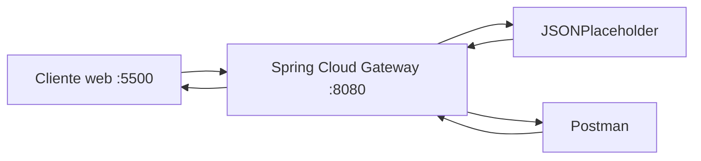

# Evidencias · Laboratorio API Gateway

## Integrantes
- Nombre:
- Nombre:
- Nombre:

## 1. Backend directo

Antes de utilizar el gateway, registrar las pruebas directas contra JSONPlaceholder.

| Método | URL | Status | Observación |
|---|---|---:|---|
| GET | `https://jsonplaceholder.typicode.com/posts` | 200 | Podemos observar que este metodo en esta pagina nos devuelve una lista entera de variables |
| GET | `https://jsonplaceholder.typicode.com/posts/1` | 200 | Podemos observar que este metodo con el 1 por delante hace que podamos ver el primer objeto de la lista que vimos antes |

**¿Qué información del backend conoce el cliente en este escenario?**

Respuesta:

---

## 2. Arquitectura final



Explicar brevemente qué responsabilidad cumple cada componente.

---

## 3. Pruebas HTTP mediante gateway

| Método | URL | Status | Headers relevantes | Interpretación |
|---|---|---:|---|---|
| GET | `/api/v1/posts` | 200 | access-control-allow-credentials: true x-content-type-options: nosniff | colección |
| GET | `/api/v1/posts/1` | 200 | content-encoding: br  | recurso individual |
| POST | `/api/v1/posts` | 201 | access-control-expose-headers
Location location
https://jsonplaceholder.typicode.com/posts/101 | creación simulada |
| PUT | `/api/v1/posts/1` | 200 | content-encoding: br | actualización simulada |
| DELETE | `/api/v1/posts/1` | 200 | cf-cache-status: DYNAMIC cache-control: no-cache | eliminación simulada |

Para POST y PUT incluir también el body enviado.

---

## 4. Routing

- URL solicitada por el cliente: http://localhost:8080/api/v1/posts/
- `id` de la route: posts-v1
- predicate que hizo match: Path=/api/v1/posts/**
- URI/integration configurada: https://jsonplaceholder.typicode.com
- path recibido finalmente por el backend:  https://jsonplaceholder.typicode.com/api/v1/posts/
- función de `RewritePath`:/api/v1 la funcion del RewritePath hace que elimine esa linea y se quede solamente con la ruta inicial osea /posts

### Recorrido de una petición

Explicar con sus palabras:

```text
cliente → gateway → backend → gateway → cliente
```

---

## 5. Versionado

- Evidencia `/api/v1`:
- Header `X-API-Version` observado:
- Evidencia `/api/v2`:
- Header `X-API-Version` observado:

Responder:

1. ¿Por qué mantener v1 y v2 simultáneamente?
R: Mantener v1 y v2 simultaneamente hace que la v2 este implementada ya y que los clientes que ocupen la pagina vayan migrando a esta nueva pero los antiguos que aun no migren puedan aun asi ocupar la pagina sin que esta se les crashee hasta que sea obligatorio ocupar la v2 y la v1 quede Deprecado
2. ¿Qué consumidores podrían seguir usando v1?
R: Los consumidores que aun no migren o actualicen mejor dicho la pagina o una app hasta que quede deprecado que eso los desarrolladores dan hasta cierto tiempo para que se actualicen
3. ¿Cuándo retirarían una versión?
R: Para retirar una version y sustituirla por otra dan primero un cierto tiempo para que los clientes tengan tiempo de actualizarse y que si no quieren por el momento puedan aun asi ocupar la version antigua 
4. ¿Versionar el contrato público es lo mismo que versionar el servidor desplegado?
R: No es lo mismo debido a que versionar el contrato publico hace que las aplicaciones que consumen tu API esten obsoletas por ejemplo que en la v1 pedias nombre y apellido en 2 campos distintos y en v2 pusiste nombre completo en solo 1 campo. En servidor desplegado  es como mas el codigo fuente , optimizas una consulta SQL o arreglaste un bug cosas que solamente vera el desarrollador y no el que consume tu API, mientras siga recibiendo respuestas tuyas de lo que pide.
---

## 6. Header transversal

- Header esperado: `X-Gateway-Lab: DSY1107`
- Evidencia observada:
- ¿Por qué este comportamiento puede considerarse transversal?:

---

## 7. CORS

### Antes de configurar CORS

- URL del cliente web: `http://localhost:5500`
- Endpoint consultado:
- Resultado visible:
- Mensaje relevante en Console/Network:

### Después de configurar CORS

- Resultado visible:
- `Access-Control-Allow-Origin`:
- `Access-Control-Allow-Methods`:

### Preflight OPTIONS

- Request utilizado:
- Status:
- Headers relevantes:

Responder:

1. ¿Por qué Postman puede funcionar cuando el navegador falla?
2. ¿Qué es un preflight?
3. ¿CORS autentica o autoriza usuarios?
4. ¿Qué riesgo tendría permitir cualquier origen sin analizar el contexto?

---

## 8. Richardson Maturity Model nivel 2

Explicar qué elementos observados en el laboratorio permiten afirmar que la API utiliza recursos, métodos HTTP y status codes con semántica HTTP.

---

## 9. Responsabilidades

| Responsabilidad | Cliente | Gateway | Backend | Justificación |
|---|:---:|:---:|:---:|---|
| routing | | | | |
| lógica de negocio | | | | |
| autenticación/autorización | | | | |
| transformación de rutas | | | | |
| persistencia | | | | |
| rate limiting | | | | |
| reglas de negocio | | | | |
| observabilidad | | | | |

---

## 10. Problemas encontrados

1. Problema:
   - causa:
   - solución:

---

## 11. Colaboración GitHub

| Integrante | Rama | Pull Request | Aporte principal |
|---|---|---|---|
| | | | |

Agregar enlaces a los Pull Requests.

---

## 12. Conclusiones

- ¿Qué problema resolvió el gateway?
- ¿Qué concepto del laboratorio sería equivalente al trabajar posteriormente con Amazon API Gateway?
- ¿Qué aprendió el grupo que no depende específicamente de Spring Cloud Gateway?
